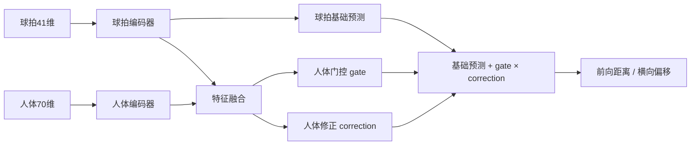
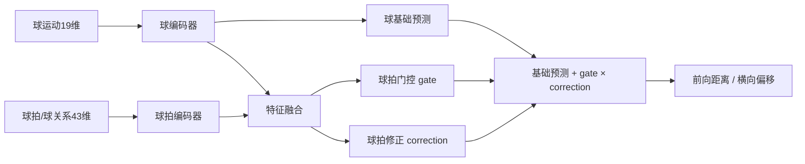

# 新版羽毛球落点预测模型：Before 与 After

本文档说明项目中最新的两套落点预测模型：

- **Before 模型**：击球前，根据球拍挥动趋势和人体动作预测落点；
- **After 模型**：击球后，根据羽毛球飞行趋势和球拍运动修正预测落点。

重点包括数据格式、轨迹如何压缩为固定维度特征、网络结构、训练目标、训练命令、验证结果、推理方式和实时部署注意事项。

---

## 1. 当前模型版本

| 用途 | 最新权重 | 特征实现 | 训练脚本 |
|---|---|---|---|
| Before：球拍 + 人体 | `models/before_pose_racket_trend.pt` | `util/before_pose_racket.py` | `train/train_before_pose_racket_trend.py` |
| After：球 + 球拍 | `models/after_ball_racket_trend.pt` | `util/after_ball_racket.py` | `train/train_after_ball_racket_trend.py` |
| After：仅球运动，保留的上一版 | `models/after_motion_trend.pt` | `util/after_motion.py` | `train/train_after_motion_trend.py` |
| 旧 Transformer Before | `models/before.pt` | `util/model.py` | 旧训练流程 |
| 旧 Transformer After | `models/after.pt` | `util/model.py` | 旧训练流程 |

新版权重没有覆盖旧权重，可以独立加载、验证和比较。

---

## 2. 相比之前模型的区别

旧 Transformer 将每帧 63 或 66 维坐标直接输入时序网络：

```text
Before：50 × 63 = 3150 个坐标值
After ：50 × 66 = 3300 个坐标值
```

这种方式模型规模大，并且 After 模型可能主要记住球的绝对位置，没有充分利用球的时间顺序和运动方向。新版模型改为显式计算具有物理含义的运动特征：

```text
新方法用最近若干有效帧拟合速度、加速度、方向和几何关系，再把这些统计量拼接成固定长度向量。

Before：球拍 41 维 + 人体 70 维 = 111 维
After ：球运动 19 维 + 球拍/球关系 43 维 = 62 维
```


---

## 3. 数据集格式

默认训练集位于：

```text
datasets/scene1+2
```

每个 `.txt` 文件代表一个样本。除最后一行外，每行格式为：

```text
frame_id:value_0,value_1,...,value_65
```

每帧共 66 个三维坐标标量：

| 切片 | 点数 | 含义 |
|---|---:|---|
| `0:51` | 17 × XYZ | COCO 17 个人体关键点 |
| `51:63` | 4 × XYZ | 4 个球拍关键点 |
| `63:66` | 1 × XYZ | 羽毛球中心坐标 |

即：

```text
[人体点0 XYZ, ..., 人体点16 XYZ,
 球拍P1 XYZ, 球拍P2 XYZ, 球拍P3 XYZ, 球拍P4 XYZ,
 羽毛球 XYZ]
```

人体分支实际使用 COCO 索引 `5~12`：

```text
5  左肩        6  右肩
7  左肘        8  右肘
9  左腕       10  右腕
11 左髋       12  右髋
```

球拍点的顺序必须保持一致：

```text
短轴向量 = P2 - P1
长轴向量 = P4 - P3
拍面法向 = normalize(短轴 × 长轴)
```

最后一行冒号后的三个值是落点标签：

```text
sample_or_frame_id:landing_x,landing_y,landing_z
```

当前训练代码将落点 Z 设为地面 `0`，核心评价指标是 XY 平面欧氏距离，单位为厘米。

### 3.1 坐标质量要求

训练和推理会过滤以下异常：

- `NaN` 或无穷值；
- 全零羽毛球坐标；
- 退化的球拍长轴或短轴；
- 球拍轴长度超出合理范围；
- 有效轨迹点不足；
- 最近有效轨迹离窗口末尾太远；
- 落点不在当前训练代码允许的场地区域；
- 落点明显位于观测运动方向后方。

---

## 4. 共同的轨迹特征计算方法

### 4.1 使用真实帧号作为时间

选中的帧号记为 `f_i`，时间平移到最后一帧：

```text
t_i = f_i - f_last
```

这样最后一帧时间为 0。中间发生丢帧时，帧号跨度仍能参与速度拟合。

### 4.2 线性速度

对 X、Y、Z 分别做最小二乘直线拟合：

```text
p(t) = v·t + b
```

斜率 `v` 为该坐标轴速度。全段速度使用全部选中点，最近速度使用最近 3 个点。

### 4.3 加速度

对每个坐标轴做二次拟合：

```text
p(t) = c2·t² + c1·t + c0
a = 2·c2
```

这样比单次相邻帧差分更能抑制三维重建噪声。

### 4.4 路径长度与直线度

```text
路径长度 = Σ ||p_i.xy - p_(i-1).xy||
弦长     = ||p_last.xy - p_first.xy||
直线度   = 弦长 / max(路径长度, ε)
```

直线度接近 1 表示观测轨迹较直，较小表示轨迹抖动或弯曲明显。

### 4.5 局部运动坐标系

设最近运动的水平单位方向为：

```text
d = normalize([vx, vy])
n = [-d_y, d_x]
```

其中 `d` 是前向方向，`n` 是水平横向方向。模型不直接回归全局 `(landing_x, landing_y)`，而是预测：

```text
target = [log(1 + forward), lateral]
```

真实落点相对最后观测点的位移为 `Δ`：

```text
forward = dot(Δ, d)
lateral = dot(Δ, n)
```

恢复全局落点：

```text
forward = exp(target_0) - 1
landing_xy = last_xy + forward·d + target_1·n
```

这种参数化让时间顺序直接参与输出几何。倒序轨迹会改变 `d`，因此预测方向必然受到影响。

---

## 5. Before 模型

### 5.1 输入窗口

训练的默认口径为：

```text
样本序列
  ↓
跳过末尾 5 帧（skip_n=5）
  ↓
在剩余窗口中寻找最近有效球拍帧
  ↓
最多使用最近 12 个有效球拍帧，至少需要 6 个
```

比较脚本通常先取击球前 50 帧，再由特征提取器从中使用最近有效轨迹。训练增强还使用 `skip_n=4/5/6` 和 10/12 个球拍点组合，以提高击球时刻轻微偏差下的稳定性。

### 5.2 球拍 41 维特征

| 特征组 | 维数 | 说明 |
|---|---:|---|
| 最后球拍中心 | 3 | 4 个球拍点的三维均值 |
| 全段球拍速度 | 3 | 全部选中帧的线性拟合 |
| 最近球拍速度 | 3 | 最近 3 帧的线性拟合 |
| 球拍加速度 | 3 | 二次拟合 |
| 观测位移 | 3 | 最后中心减最初中心 |
| XY 路径长度 | 1 | 水平轨迹累计长度 |
| XY 路径直线度 | 1 | 弦长除以路径长度 |
| 有效球拍帧数 | 1 | 实际使用的轨迹点数量 |
| 球拍帧跨度 | 1 | 最后帧号减第一帧号 |
| 短轴方向 | 3 | 最近短轴方向的归一化均值 |
| 长轴方向 | 3 | 最近长轴方向的归一化均值 |
| 拍面法向 | 3 | 长短轴叉积的归一化均值 |
| 短轴和长轴长度 | 2 | 最后一帧几何尺度 |
| 短轴角速度 | 3 | 短轴单位向量随时间变化率 |
| 长轴角速度 | 3 | 长轴单位向量随时间变化率 |
| 拍面角速度 | 3 | 拍面法向随时间变化率 |
| 全段速度大小 | 1 | `||v||` |
| 最近速度大小 | 1 | `||v_recent||` |

维数计算：

```text
3+3+3+3+3 + 1+1+1+1 + 3+3+3 + 2 + 3+3+3 + 1+1 = 41
```

### 5.3 人体 70 维特征

人体分支使用肩、肘、腕、髋共 8 个关键点。骨盆中心和肩中心定义为：

```text
pelvis   = (left_hip + right_hip) / 2
shoulder = (left_shoulder + right_shoulder) / 2
```

人体尺度使用肩宽、髋宽和躯干长度的均值：

```text
body_scale = mean(shoulder_width, hip_width, torso_length)
```

位置和速度先相对骨盆，再除以人体尺度，从而减少站位平移和身高差异的影响。

| 特征组 | 计算 | 维数 |
|---|---:|---:|
| 8 点相对骨盆位置 | `8 × XYZ` | 24 |
| 8 点相对骨盆速度 | `8 × XYZ` | 24 |
| 肩轴 | `XYZ` | 3 |
| 髋轴 | `XYZ` | 3 |
| 躯干轴 | `XYZ` | 3 |
| 躯干法向 | `XYZ` | 3 |
| 归一化肩宽、髋宽、躯干长度和人体尺度 | 4 个标量 | 4 |
| 骨盆速度 | `XYZ` | 3 |
| 肩相对骨盆速度 | `XYZ` | 3 |

维数计算：

```text
24 + 24 + 3+3+3+3 + 4 + 3+3 = 70
```

因此 Before 总输入为：

```text
41 + 70 = 111 维
```

### 5.4 网络结构



两个编码器均为小型 MLP：

```text
Linear → LayerNorm → SiLU → Dropout
→ Linear → LayerNorm → SiLU
```

最终预测：

```text
prediction = racket_prediction + body_gate × body_correction
```

门控值通过 Sigmoid 限制在 `0~1`，分别控制人体信息对前向和横向两个目标的修正强度。

### 5.5 Before 损失函数

```text
Loss = final SmoothL1
     + 0.25 × 球拍基础分支 SmoothL1
     + 0.10 × 方向损失
     + 0.02 × 人体门控修正幅度惩罚
```

球拍基础分支辅助损失保证球拍趋势可以独立产生合理预测；人体分支用于修正，不应完全覆盖球拍主趋势。

---

## 6. After 模型

### 6.1 输入窗口

After 模型从窗口中选择最近最多 6 个非零、有限的羽毛球三维点，并取这些帧对应的球拍坐标：

```text
击球后窗口
  ↓
最近最多 6 个有效球点
  ↓
与球点同帧的球拍几何
  ↓
球运动 19 维 + 球拍/球关系 43 维
```

训练要求至少 5 个有效球点；推理提取器最低可接受 4 个球点。最新版球拍分支至少需要 3 个有效球拍帧，且最后一个选中球点必须有有效球拍几何。

### 6.2 球运动 19 维特征

| 特征组 | 维数 |
|---|---:|
| 最后球坐标 | 3 |
| 全段线性速度 | 3 |
| 最近速度 | 3 |
| 加速度 | 3 |
| 已观测位移 | 3 |
| XY 路径长度 | 1 |
| XY 路径直线度 | 1 |
| 有效球点数量 | 1 |
| 球轨迹帧跨度 | 1 |

维数计算：

```text
3+3+3+3+3 + 1+1+1+1 = 19
```

### 6.3 球拍及球拍—球关系 43 维特征

球拍自身运动和几何共 29 维：

| 特征组 | 维数 |
|---|---:|
| 球拍中心 | 3 |
| 全段球拍速度 | 3 |
| 最近球拍速度 | 3 |
| 球拍加速度 | 3 |
| 短轴方向 | 3 |
| 长轴方向 | 3 |
| 拍面法向 | 3 |
| 长短轴长度 | 2 |
| 短轴角速度 | 3 |
| 长轴角速度 | 3 |

```text
3+3+3+3+3+3+3+2+3+3 = 29
```

球拍与球的交互关系共 14 维：

| 特征组 | 维数 | 含义 |
|---|---:|---|
| 球相对球拍中心位置 | 3 | `ball - racket_center` |
| 球与球拍相对速度 | 3 | `ball_velocity - racket_velocity` |
| 球速度在短轴、长轴、法向上的投影 | 3 | 球离拍方向 |
| 相对速度在短轴、长轴、法向上的投影 | 3 | 碰撞后相对运动 |
| 最后一帧球拍—球距离 | 1 | 当前分离距离 |
| 观测期间最小球拍—球距离 | 1 | 接触接近程度 |

```text
3+3+3+3+1+1 = 14
29 + 14 = 43
```

因此 After 总输入为：

```text
19 + 43 = 62 维
```

### 6.4 网络结构



最终预测：

```text
prediction = ball_prediction + racket_gate × racket_correction
```

球轨迹决定主要落点趋势，球拍信息用于修正击球姿态和球拍—球相对运动带来的残差。

### 6.5 After 损失函数

```text
Loss = final SmoothL1
     + 0.25 × 球基础分支 SmoothL1
     + 0.10 × 方向损失
     + 0.02 × 球拍门控修正幅度惩罚
```

---

## 7. 特征维数固定后是否与帧数无关

只在“张量形状”意义上与帧数无关：

```text
Before 无论使用 6、10 或 12 个有效球拍帧，始终输出 111 维；
After  无论使用 4、5 或 6 个有效球点，始终输出 62 维。
```

但特征值仍与帧数、帧号、时间顺序和坐标有关：

- 有效点数量和帧跨度本身就是特征；
- 点数变化会改变速度和加速度拟合；
- 删除最近点会改变最后位置和最近速度；
- 倒序轨迹会改变运动方向和局部坐标系；
- 超过上限的更早帧通常不会再影响特征。

当前速度单位是“厘米/帧”，能处理帧号跳变，但不同 FPS 之间并不天然等价。如果训练和部署 FPS 不一致，应改为使用秒级时间戳，再重新训练：

```text
t_seconds = timestamp_seconds - last_timestamp_seconds
```

---

## 8. 数据划分和增强

### 8.1 按采集组划分

文件名形如：

```text
group---sample_id.txt
```

训练和验证按 `group` 划分，而不是随机按文件划分。同一采集组不会同时出现在训练和验证中，避免相邻样本泄漏。

当前两套最新模型的训练/验证 group 交集均为 0。

### 8.2 镜像增强

训练样本沿球场 Y 轴镜像：

```text
所有点的 y = -y
落点标签的 y = -y
```

### 8.3 Before 时间窗口增强

Before 使用以下组合生成训练实例：

```text
skip=4，最多10个球拍点
skip=5，最多12个球拍点
skip=6，最多10个球拍点
```

每个组合再生成 Y 镜像样本。

### 8.4 After 轨迹长度增强

After 对同一样本使用 5 点和 6 点球轨迹，并生成 Y 镜像样本。这使模型能在实时系统刚获得第 5 个球点时开始工作，并在第 6 个球点到来后更新结果。

---

## 9. 训练命令

所有命令都应从项目根目录运行：

```powershell
cd "E:\badminton_landing_pred-main (4)\badminton_landing_pred-main"
```

### 9.1 训练最新 Before

```powershell
python train/train_before_pose_racket_trend.py `
  --data-dir datasets/scene1+2 `
  --model-out models/before_pose_racket_trend.pt `
  --report-dir results/before_pose_racket_trend `
  --epochs 300 `
  --patience 40 `
  --batch-size 256 `
  --lr 0.001 `
  --weight-decay 0.0001 `
  --val-ratio 0.2 `
  --skip-n 5 `
  --max-racket-points 12 `
  --device cuda
```

### 9.2 训练最新 After

```powershell
python train/train_after_ball_racket_trend.py `
  --data-dir datasets/scene1+2 `
  --model-out models/after_ball_racket_trend.pt `
  --report-dir results/after_ball_racket_trend `
  --epochs 300 `
  --patience 40 `
  --batch-size 256 `
  --lr 0.001 `
  --weight-decay 0.0001 `
  --val-ratio 0.2 `
  --max-ball-points 6 `
  --device cuda
```

### 9.3 可选：训练仅球趋势 After

```powershell
python train/train_after_motion_trend.py `
  --data-dir datasets/scene1+2 `
  --model-out models/after_motion_trend.pt `
  --report-dir results/after_motion_trend `
  --epochs 300 `
  --patience 40 `
  --batch-size 256 `
  --lr 0.001 `
  --device cuda
```

`epochs` 是最大轮数，实际训练会根据验证集 XY 平均误差早停。保存的是验证指标最好的权重，不是最后一轮权重。

---

## 10. 训练输出和逐轮记录

### 10.1 Before 输出

```text
models/before_pose_racket_trend.pt
results/before_pose_racket_trend/training_history.csv
results/before_pose_racket_trend/training_report.json
results/before_pose_racket_trend/validation_predictions.csv
```

### 10.2 After 输出

```text
models/after_ball_racket_trend.pt
results/after_ball_racket_trend/training_history.csv
results/after_ball_racket_trend/training_report.json
results/after_ball_racket_trend/validation_predictions.csv
```

`training_history.csv` 每行对应一个 epoch，记录训练损失、验证平均/中位误差、基础分支误差、门控均值和学习率。

`training_report.json` 记录数据过滤数量、训练/验证样本数、group 数量、最佳轮次和最终验证指标。

---

## 11. 当前训练结果

### 11.1 Before

| 项目 | 数值 |
|---|---:|
| 原始文件 | 3857 |
| 有效样本 | 3705 |
| 训练/验证样本 | 2950 / 755 |
| 训练/验证 group | 304 / 78 |
| 增强后训练实例 | 17286 |
| 最佳轮次 | 68 |
| 实际训练到 | 108（早停） |
| 验证 XY 平均误差 | 100.13 cm |
| 验证 XY 中位误差 | 84.08 cm |
| 验证 P90 | 193.81 cm |

球拍基础分支平均误差为 112.47 cm，加入人体门控修正后为 100.13 cm。

在相同 755 个输入样本上，旧 `before.pt` 的参考平均误差为 192.50 cm，新模型在 537/755 个样本上更好。旧 checkpoint 的原始训练划分未知，因此旧模型结果是参考比较，不等同于重新训练后的严格无泄漏对照。

### 11.2 After

| 项目 | 数值 |
|---|---:|
| 原始文件 | 3857 |
| 球轨迹质量通过 | 3761 |
| 球 + 球拍质量通过 | 3735 |
| 训练/验证样本 | 2975 / 760 |
| 训练/验证 group | 304 / 78 |
| 增强后训练实例 | 11866 |
| 最佳轮次 | 54 |
| 最新球 + 球拍模型平均误差 | 57.04 cm |
| 中位误差 | 44.99 cm |
| P90 | 113.94 cm |

在同一 760 个验证样本上：

| 模型 | XY 平均误差 | 中位误差 | P90 |
|---|---:|---:|---:|
| 仅球运动 `after_motion_trend.pt` | 61.95 cm | 50.26 cm | 120.69 cm |
| 球 + 球拍 `after_ball_racket_trend.pt` | 57.04 cm | 44.99 cm | 113.94 cm |

---

## 12. 5 个外部样本的解释

外部测试目录：

```text
datasets/2026-7-10test/4-poseball
datasets/2026-7-10test/3-fit
```

这 5 个姿态文件没有实测落点标签，因此只能将落点拟合算法的输出作为代理参照，不能把“对拟合落点的差值”解释为真实落点误差。

当前结果：

| 模型 | 对拟合落点平均差值 |
|---|---:|
| 新 Before | 118.59 cm |
| 旧 Before | 235.74 cm |
| 新 After：球 + 球拍 | 68.76 cm |
| After：仅球运动 | 83.85 cm |
| 旧 After Transformer | 321.53 cm |

消融测试：

- 新 Before 倒序球拍轨迹后，预测平均移动 786.62 cm；
- 新 Before 将球拍平移速度缩小到 10% 后，预测平均移动 301.43 cm；
- 新 Before 倒序人体动作后，预测平均移动 55.07 cm；
- 新 After 倒序球轨迹后，预测平均移动 1270.04 cm；
- 新 After 倒序球拍轨迹后，预测平均移动 69.54 cm；
- 新 After 冻结球拍轨迹后，预测平均移动 63.15 cm。

这些结果说明新模型确实使用了运动时间顺序，而不是只使用最后一个绝对坐标。

---

## 13. 验证命令

### 13.1 Before

```powershell
python infer/validate_before_models_scene1_2.py
python infer/validate_before_pose_racket_trend.py
```

输出：

```text
results/before_pose_racket_trend/same_split_model_comparison.json
results/before_pose_racket_trend/same_split_model_comparison.csv
results/before_pose_racket_trend/five_sample_validation.json
results/before_pose_racket_trend/five_sample_validation.csv
```

### 13.2 After

```powershell
python infer/validate_after_models_scene1_2.py
python infer/validate_after_ball_racket_trend.py
```

输出：

```text
results/after_ball_racket_trend/same_split_model_comparison.json
results/after_ball_racket_trend/same_split_model_comparison.csv
results/after_ball_racket_trend/five_sample_validation.json
results/after_ball_racket_trend/five_sample_validation.csv
```

---

## 14. 5 样本推理与三维可视化

从项目根目录运行：

```powershell
python infer/compare_duida_pose_fit_predictions.py `
  --pose-model models/before_pose_racket_trend.pt `
  --fit-model models/c_parameter_mlp_fall.pt `
  --pose-mode before `
  --pose-dir datasets/2026-7-10test/4-poseball `
  --fit-dir datasets/2026-7-10test/3-fit `
  --pose-skip-n 5
```

输出：

```text
infer/duida_pose_fit_prediction_comparison.csv
infer/duida_pose_fit_prediction_summary.json
infer/duida_pose_fit_3d/*.html
```

三维 HTML 显示：

- 落点拟合使用的球坐标和拟合/外推曲线；
- Before 球拍中心轨迹；
- After 球拍中心轨迹；
- After 实际使用的球轨迹；
- 拟合落点；
- 当前加载的 Before 落点；
- 当前加载的 After 落点。

三维图不会再绘制旧模型和球-only参考版本的额外落点；这些参考数值仍保留在 CSV 中用于分析。

---

## 15. Python 推理接口

### 15.1 Before

```python
from pathlib import Path
import numpy as np

from util.before_pose_racket import BeforePoseRacketPredictor

predictor = BeforePoseRacketPredictor(
    Path("models/before_pose_racket_trend.pt")
)

# frames: (N, 63)，人体17点 + 球拍4点
# frame_ids: (N,)
landing_xyz = predictor.predict(
    np.asarray(frames, dtype=np.float32),
    np.asarray(frame_ids),
)
```

### 15.2 After

```python
from pathlib import Path
import numpy as np

from util.after_ball_racket import AfterBallRacketPredictor

predictor = AfterBallRacketPredictor(
    Path("models/after_ball_racket_trend.pt")
)

# frames: (N, 66)，人体17点 + 球拍4点 + 羽毛球1点
# After 实际只读取球拍 51:63 和球 63:66
landing_xyz = predictor.predict(
    np.asarray(frames, dtype=np.float32),
    np.asarray(frame_ids),
)
```

返回值均为：

```text
[landing_x_cm, landing_y_cm, 0.0]
```

---

## 16. 实时部署建议

新版小型 MLP 比旧 Transformer 更适合实时部署。推荐状态机：

```text
等待击球
  ↓
持续保存人体/球拍环形缓冲区
  ↓
检测球拍接近球、球速度突变或方向突变
  ↓
击球事件
  ├─ 从击球前缓冲区计算 Before
  └─ 清空 After 球轨迹，开始收集击球后球点
         ↓
      满足最少点数后计算 After
         ↓
      每个新球点到来时更新落点
```

建议保留最近 50 帧环形缓冲区：

```python
from collections import deque

frames = deque(maxlen=50)
frame_ids = deque(maxlen=50)
```

生产环境需要特别处理：

1. **坐标一致性**：单位、原点、X/Y/Z 方向必须与训练集一致；
2. **球拍点顺序**：P1/P2 和 P3/P4 不能交换；
3. **FPS**：不同 FPS 推荐改用秒级时间戳并重新训练；
4. **三维噪声**：速度和加速度对抖动敏感，建议使用轻量卡尔曼或中值滤波；
5. **缺失点**：球点不足时不输出 After，球拍缺失时可降级到 `after_motion_trend.pt`；
6. **回合重置**：每次新击球后清空上一回合的 After 轨迹；
7. **输入拒绝**：异常轴长度、非有限坐标、速度过小和最近点过旧时不要强行预测。

当前 Before 必须使用人体姿态和球拍坐标。如果实时系统只有球和球拍，最新 After 可以直接接入；Before 需要补充人体 17 点，或者另行训练球拍-only Before 模型。

当前 `skip_n=5` 的 Before 口径是：检测到击球后，从环形缓冲区取击球前第 5 帧以前的数据进行预测。如果要在尚未击球时提前预测，需要额外训练严格因果的多提前量窗口，并增加击球阶段检测。

---

## 17. 

旧权重约 143 MB，新权重约 0.4~0.5 MB。新版训练更快：

- 不再计算 50 帧之间的 Transformer 自注意力；
- 运动特征在 epoch 循环前预先计算；
- 网络只预测前向/横向两个目标；
- Batch Size 从旧流程常用的 32 提高到 256；
- 使用验证误差早停；
- 模型参数量显著减少。


---

## 18. 环境检查与常见问题

训练和推理前检查实际 Python 环境：

```powershell
python -c "import sys, torch, numpy; print(sys.executable); print(torch.__version__); print(torch.cuda.is_available()); print(numpy.__version__)"
```

执行落点拟合比较还需要 SciPy：

```powershell
python -c "import scipy; print(scipy.__version__)"
```

如果堆栈显示加载了另一个项目（例如 PointNet）的 `.venv`，说明当前 PowerShell 激活的不是预期环境。应先确认：

```powershell
Get-Command python
python -c "import sys; print(sys.executable)"
```

NumPy 在 `defchararray.py` 中出现递归错误通常属于 NumPy/SciPy 安装不完整或版本混装问题，与模型本身无关。需要在当前实际解释器中重新安装相互兼容的 NumPy 和 SciPy。

### 常见推理错误

| 错误 | 常见原因 |
|---|---|
| 有效球点不足 | 球检测缺失、球坐标为全零 |
| 最近水平速度过小 | 轨迹点重复或三维重建失败 |
| 球拍轴退化 | 4 个球拍点顺序错误或重合 |
| 最后球点没有有效球拍 | 球拍检测在关键帧丢失 |
| Before 人体帧不足 | 肩、肘、腕或髋坐标缺失 |
| 输出方向异常 | 坐标轴方向、单位或球拍点顺序与训练不一致 |

---

## 19. 相关文件索引

```text
util/after_motion.py
util/after_ball_racket.py
util/before_pose_racket.py

train/train_after_motion_trend.py
train/train_after_ball_racket_trend.py
train/train_before_pose_racket_trend.py

infer/compare_duida_pose_fit_predictions.py
infer/validate_after_models_scene1_2.py
infer/validate_after_ball_racket_trend.py
infer/validate_before_models_scene1_2.py
infer/validate_before_pose_racket_trend.py

docs/after_motion_trend.md
docs/after_ball_racket_trend.md
docs/before_pose_racket_trend.md
```

---

## 20. 结论

新版模型的核心不是简单缩小网络，而是把落点预测改写为运动坐标系中的问题：

```text
Before：球拍挥动趋势为主，人体动力链进行门控修正；
After ：球飞行趋势为主，球拍及球拍—球关系进行门控修正。
```

显式速度、加速度、方向和相对关系使时间顺序真正参与预测；固定维度特征和小型 MLP 则降低训练与实时推理成本。实际部署效果最终仍取决于三维坐标质量、坐标系一致性、FPS、击球检测以及与训练集的分布一致程度。
